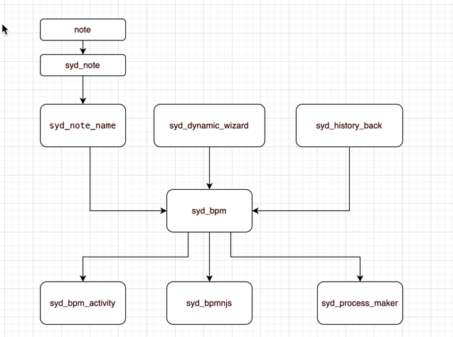
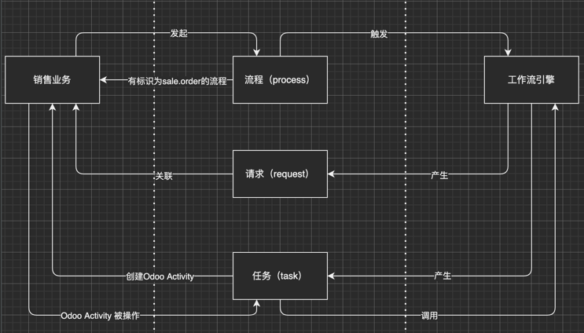

# ODOO链接ProcessMaker

B.P.M. 将 <a href="http://www.odoo.com">Odoo</a> 与 <a href="https://www.processmaker.com/">ProcessMaker</a> (4)进行了对接。

[<a href="docs/README-OLD.md">之前项目的Readme</a>]

Odoo版本： 当前版本15，接下来是14、16

开发计划，见Issues。

贡献：

[<a href="https://github.com/feitas">乐川</a>] | [<a href="https://github.com/granzonchen">银枫</a>]

# 如何开发

代码是基于V13的版本继续开发的，刚开始可能会稍感不适，以后也不敢保证永不重构，但现在是这样的...

Odoo与PM之间的过程关系图

